# Домашнее задание к занятию «DevSecOps и AppSec. Часть 2»

Пришлите ответы на вопросы в личном кабинете на сайте [netology.ru](https://netology.ru).

## Описание

Домашнее задание — лабораторная работа, в которой вы по инструкциям выполните действия.

Обратите внимание, что домашнее задание является необязательным. Его выполнение не повлияет на получение зачёта по модулю.

## Задание GitLab

В этом задании применяется сервис GitLab — один из комплексных и самых популярных решений для поддержки DevOps и DevSecOps.

Вы будете использовать пробную версию из облака для упрощения настройки и развёртывания.

Командой GitLab уже подготовлены и настроены инструменты, которые позволяют выполнять действия:
1. Анализировать код на уязвимости — SAST, включая зависимости — SCA или Dependency Scanning.
2. Анализировать контейнеры на уязвимости — Container Scanning.
3. Анализировать используемые в проекте лицензии — License Scanning.
4. Проверять секреты — Secret Detection.

Список всех проверок доступен по адресам:
* https://gitlab.com/gitlab-org/gitlab/-/tree/master/lib/gitlab/ci/templates/Security;
* https://docs.gitlab.com/ee/user/application_security/ (документация).

### Этапы выполнения

1\. Перейдите по [ссылке](https://gitlab.com/-/trial_registrations/new) и зарегистрируйте новую учётную запись. Попросит подтвердить почтовый ящик, поэтому указываем действую почту.


2\. Установите значения, как на скриншоте, и нажмите кнопку Continue. (В полях надо указать любую страну и любой номер телефона.)

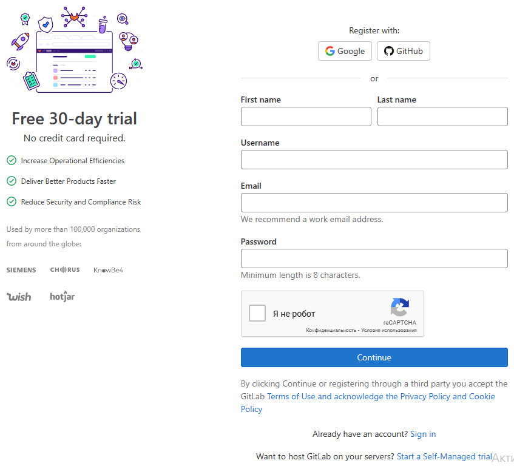

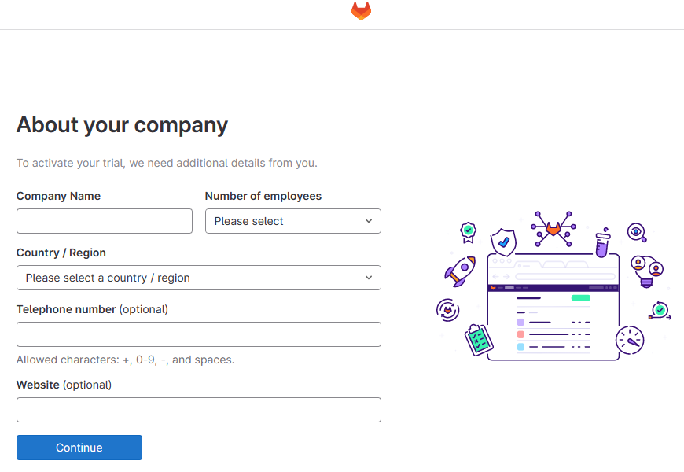


3\. Во вкладке Create заполните поля и нажмите Create project.

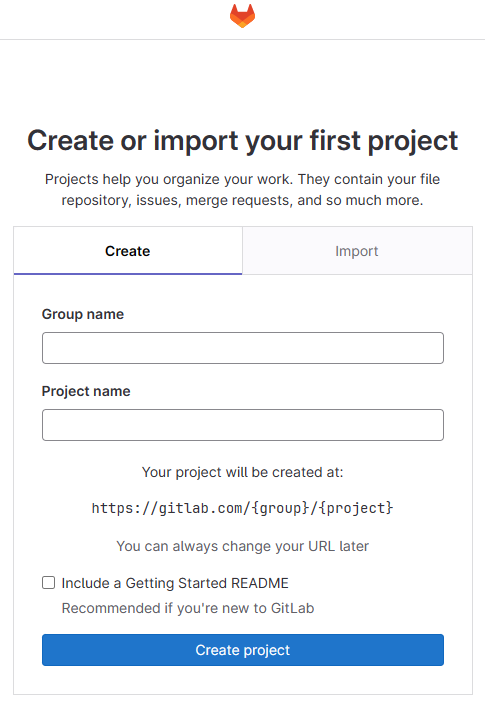

4\. Выберите пункт меню Projects и нажмите кнопку New project.

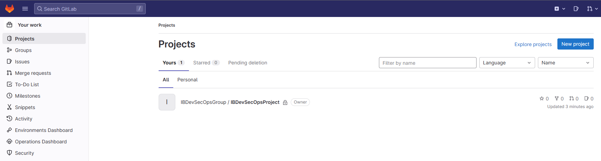

5\. Выберите Create a project для создания нового проекта.

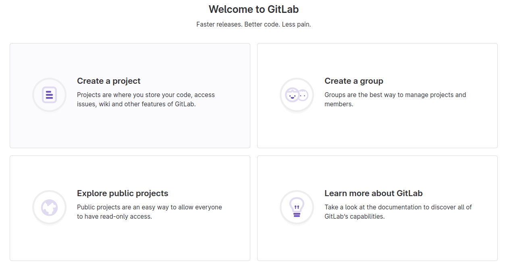

6\. Выберите Import project.

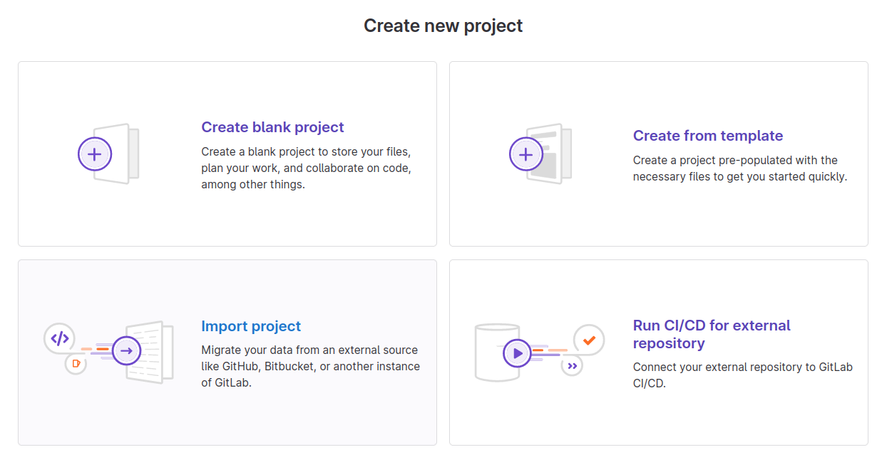

7\. Нажмите на кнопку Repository By URL и заполните поле Git repository URL ссылкой https://github.com/netology-code/ib-devsecops-app.git.

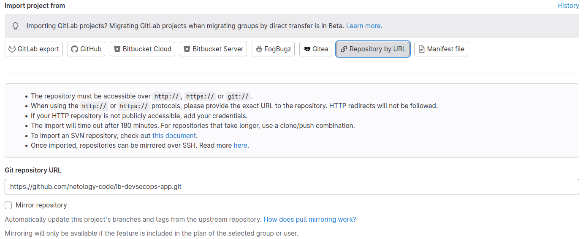

8\. Введите значения в поля Project name и Project slug и нажмите Create project.

9\. Зайдите в пункт меню CI/CD — Pipelines и нажмите на кнопку Run Pipeline.

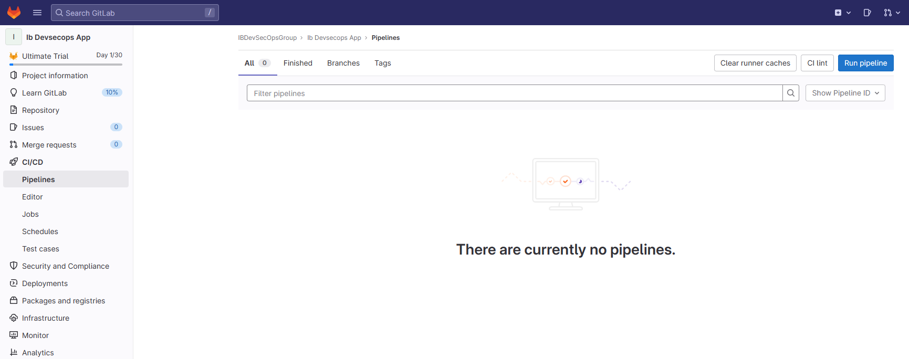

10\. Нажмите на кнопку Run Pipeline.

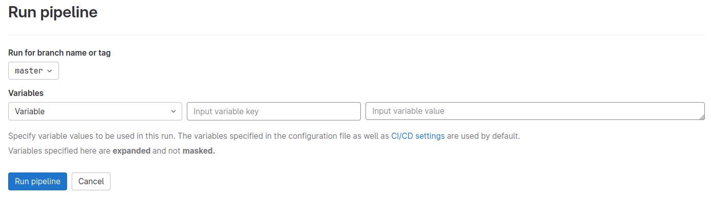

11\. Вы увидите сообщение о необходимости валидации аккаунта с помощью кредитной карты. Если у вас есть карта иностранного банка, вы можете воспользоваться ей. Если карты нет, следуйте дальнейшим шагам.

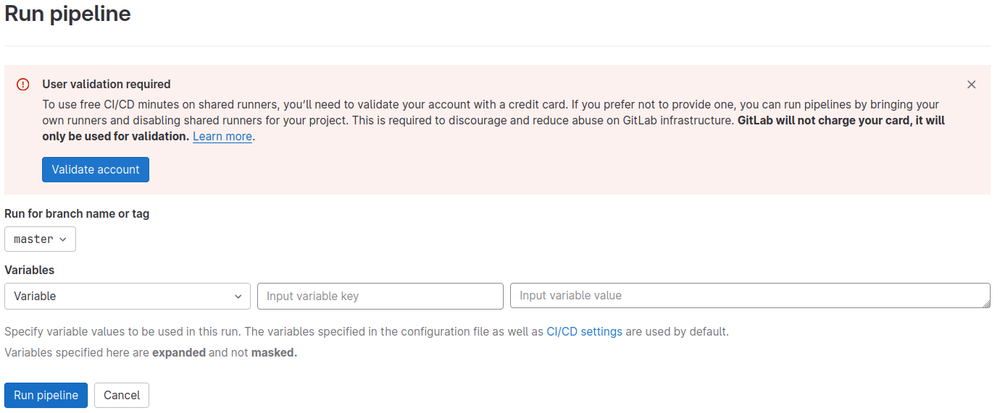

12\. Перейдите в Settings — CI/CD.

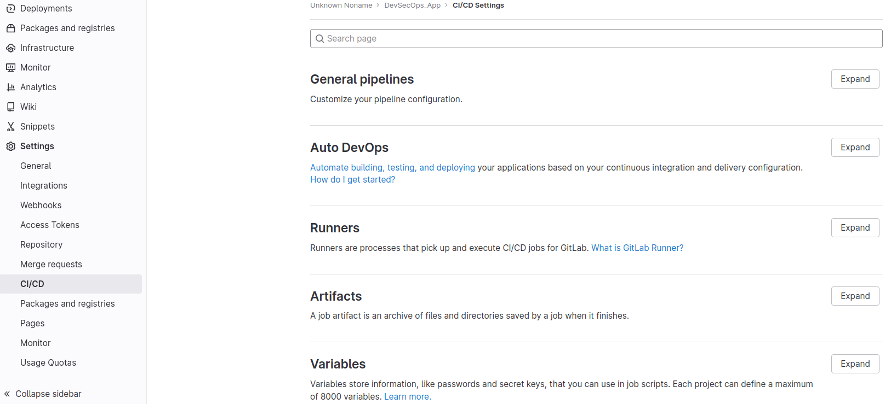

13\. Найдите пункт Runners и кликните Expand.

14\. Отключите Shared Runners. Не закрывайте эту страницу. Она понадобится нам дальше.

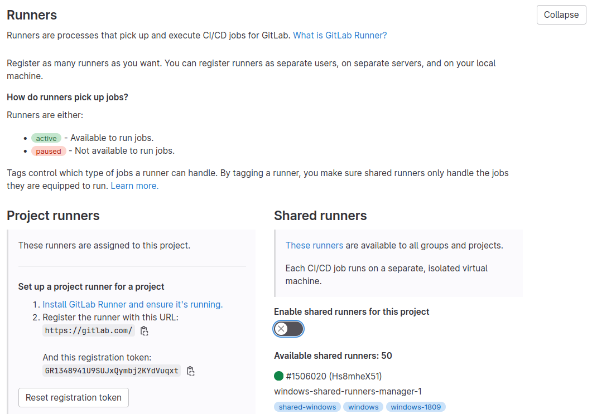

15\. Сейчас мы создадим gitlab-runner для нашего проекта.

**Установка Runner**

Откройте терминал и введите команду:

```wget https://packages.gitlab.com/install/repositories/runner/gitlab-runner/script.deb.sh```

В примере загружен скрипт для систем на базе пакетов DEB (Ubuntu, Kali).

Открываем его на редактирование:

```nano script.deb.sh```

Находим строки:

```
  # remove whitespace from OS and dist name
  os="${os// /}"
  dist="${dist// /}"
```

И меняем их на что-то подобное:

```
  # remove whitespace from OS and dist name
  os="ubuntu"
  dist="impish"
```

В этом примере описана установка, как для Ubuntu 21.10.

Запускаем скрипт:

```sudo bash script.deb.sh```

После успешной установки введите команду:

```sudo apt-get install gitlab-runner```

После установки gitlab-runner разрешаем автозапуск сервиса и стартуем его:

```sudo systemctl enable gitlab-runner --now```

**Регистрация**

Для корректной работы Runner его нужно связать с нашим проектом в GitLab.

Введите команду:

```sudo gitlab-runner register```

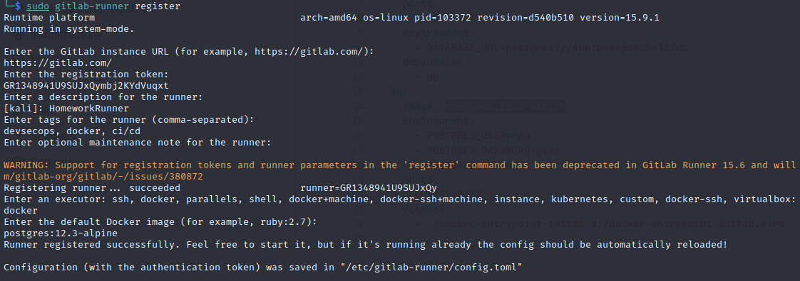

Система в интерактивном режиме запросит данные для регистрации — вводим их:

- **https://gitlab.com/** — адрес нашего сервера GitLab, его можно увидеть на странице с параметрами, которую мы оставили открытой на предыдущем шаге;

- **GR1348941U9SUJxQymbj2KYdVuqxt** — токен для регистрации раннера, его можно увидеть на странице с параметрами, которую мы открывали выше;

- **HomeworkRunner** — произвольное описание для нашего раннера;

- **devsecops, docker, ci/cd** — теги. Рекомендуется максимально точно описывать раннер тегами. С их помощью можно указывать, на каких раннерах должны выполняться те или иные задачи;

- этот пункт опционален, мы его пропускаем;

- **docker** — выбираем исполнителя из предложенных вариантов. В нашем случае это docker;

- **postgres:12.3-alpine** — базовый образ Docker, описан в файле docker-compose.yml.

Конфигурационный файл раннера находится в каталоге /etc/gitlab-runner/config.toml.

Обновим страницу с параметрами для регистрации раннера. Ниже мы должны увидеть, что у нас появился один новый элемент.

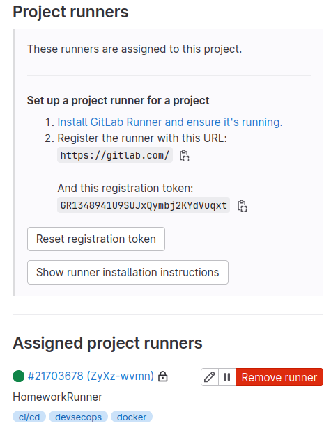

Кликните на иконку с изображением карандаша и установите параметры, как на скриншоте ниже.

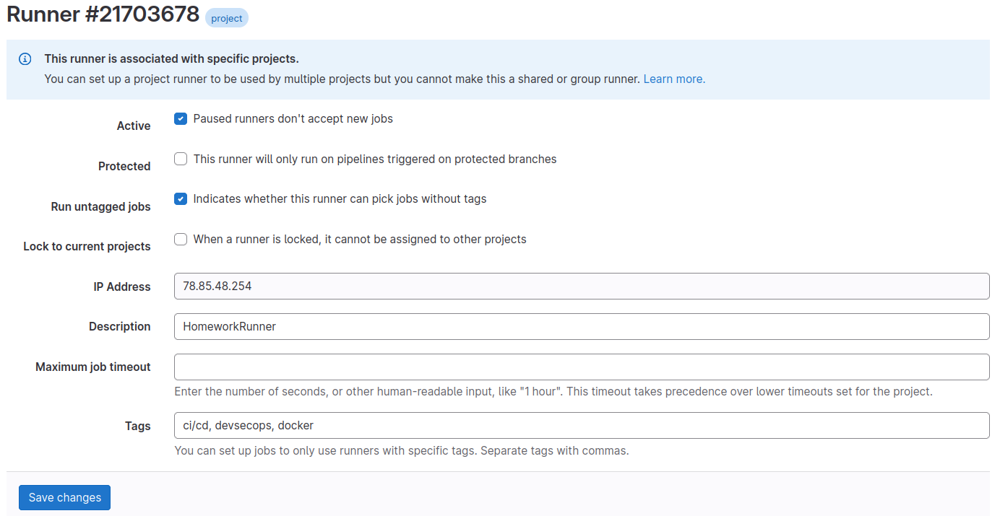

16\. Теперь раннер создан и зарегистрирован. Если вы ещё раз нажмёте Run pipeline, скорее всего, вы увидите такое состояние. Исправим это.

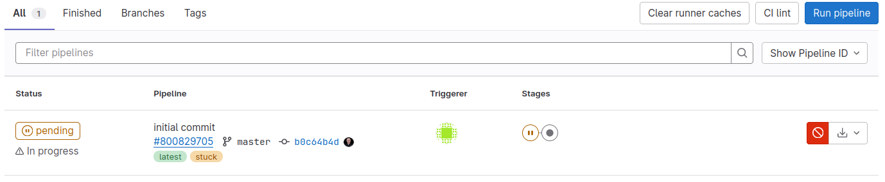

17\. Перейдите в /etc/gitlab-runner/.

18\. Отредактируйте config.toml следующим образом:

- найдите строку “privileged = false” и измените “false” на “true”;
- стоку “volumes = ["/cache"]” измените на “volumes = ["/var/run/docker.sock:/var/run/docker.sock", "/cache"]”.

После изменений файл должен выглядеть так:

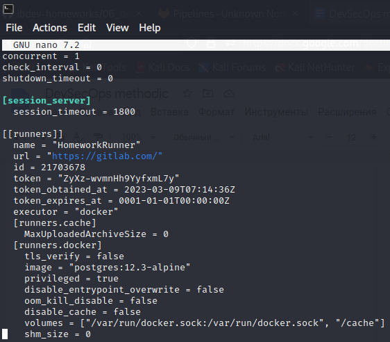

19\. Сохраните изменения в файле. После этого процесс анализа должен начаться автоматически.

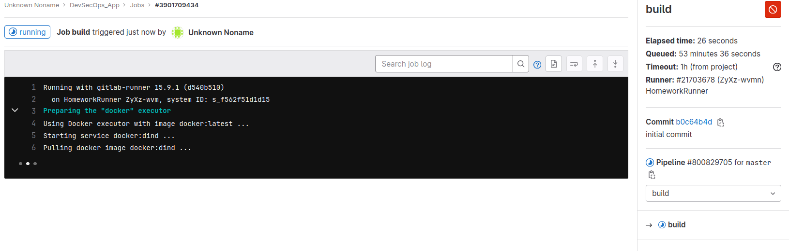

20\. Дождитесь окончания процесса анализа.


21\. Перейдите в раздел Security & Compliance.

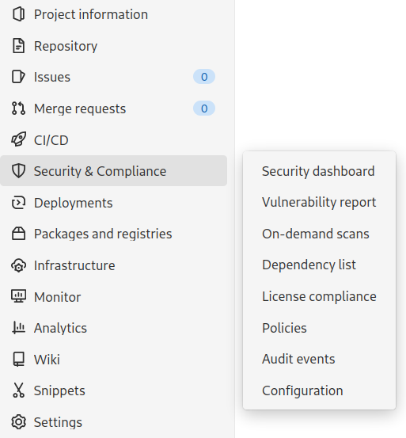

22\. Изучите внимательно разделы:

- Vulnerability Report — отчёт об уязвимостях;
- Dependency List;
- License Compliance.

### Ответьте на вопросы:

**Важно**: после окончания проверки подождите пару минут и несколько раз обновите страницу через `Shift` + `F5`. Иногда не все данные по проверкам подтягиваются сразу. Убедитесь, что уязвимости точно найдены для приложения, зависимостей и контейнера.

**Вопросы для домашнего задания** 

1\. Сколько уязвимостей и какого уровня значимости найдено (Severity)?


2\. Сколько из них:
- в самом приложении (SAST);
- в контейнерах (Container Scanning);
- в зависимостях (Dependency Scanning);
- секретов (Secret Detection)?

3\. Какая уязвимость найдена в самом приложении?
4\. Сколько зависимостей в приложении?
5\. Сколько различного рода лицензий используется в приложении и его зависимостях?

### Решение задания

Пришлите в личном кабинете ответы на вопросы из раздела «Ответьте на следующие вопросы» и скриншот статистики со всеми найденными уязвимостями. Нужны только числа в секциях `Critical`, `High`, `Medium`, `Low`.

Не удаляйте свою учётную запись после завершения работы. Она вам понадобится на следующей лекции.


