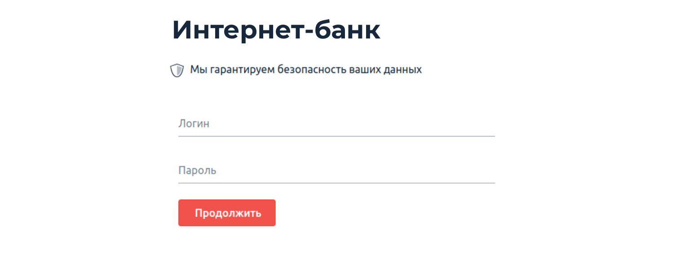
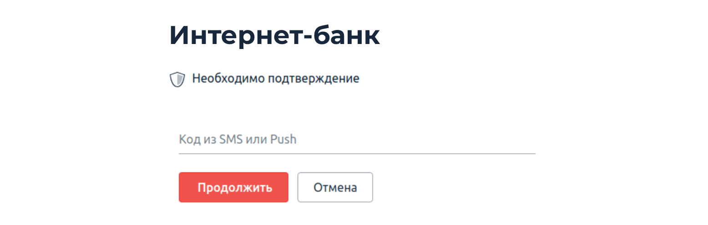
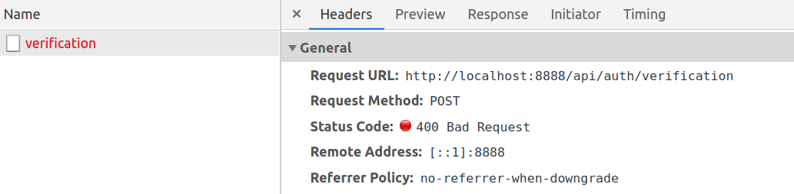
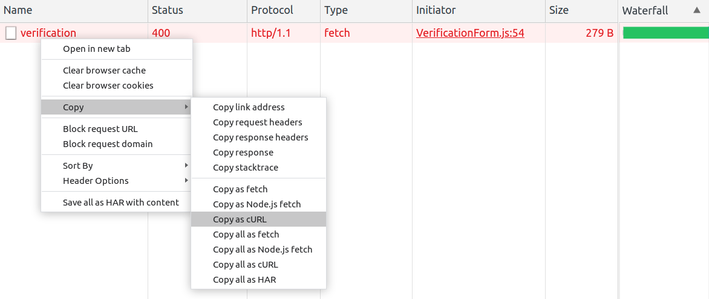

# Домашнее задание к занятию «1.3. SQL и транзакции»

В качестве результата пришлите ответы на вопросы в личном кабинете студента на сайте [netology.ru](https://netology.ru).

Важно: перед выполнением ДЗ обязательно ознакомьтесь с инструкцией [по установке Docker](https://github.com/netology-code/ibdev-homeworks/blob/master/01_docker/installation.md).

## Описание

Разработчики подготовили прототип будущей системы интернет-банка.

Для запуска нужно скачать файлы из каталога `assets`:
* [`docker-compose.yml`](./assets/docker-compose.yml);
* [`docker-entrypoint-initdb.d/init.sql`](./assets/docker-entrypoint-initdb.d/init.sql).

После скачивания структура на вашем диске должна иметь вид:
* файл `docker-compose.yml`;
* каталог `docker-entrypoint-initdb.d`;
    * файл `init.sql`.
    
Для запуска используйте команду `docker-compose up`.

Для остановки и удаления контейнеров используйте `docker-compose down`.

## Задание «Логин и пароль»

### Этапы выполнения

Фронтенд сервиса работает на порту 8888:



Используя ваши знания об SQL Injection, подберите входные данные так, чтобы попасть на следующий экран с подтверждением кода без знания пароля, при этом вы при помощи методов социальной инженерии узнали, что в системе существует пользователь с логином `sasha`.

Примечание*. Конечно, вы можете подсмотреть хеш пароля в БД, но пароль ещё придётся подобрать.

<details>
<summary>Подсказка</summary>

Контейнер PostgreSQL настроен так, что логирует все SQL-запросы, присылаемые сервером. Воспользуйтесь этим.
</details>

### Результаты выполнения задания

В качестве результата пришлите входные данные, которые позволяют пройти на следующий экран без знания пароля пользователя.

## Код подтверждения*

**Важно**. Это необязательное задание. Его выполнение не влияет на получение зачёта по домашней работе.

### Описание

Если вы добрались до экрана ввода кода подтверждения, то увидите следующую картину:



### `UNION`

В SQL есть специальная конструкция `UNION`, которая позволяет объединить данные нескольких запросов.

Пример:
```sql
SELECT login, password FROM users
UNION
SELECT number, status FROM cards
```

Сложит в результаты запроса данные из двух таблиц:
| login | password |
| --- | ----------- |
| sasha | ... |
| masha | ... |
| 5559 0000 0000 0001 | ... |
| 5559 0000 0000 0002 | ... |

Этот пример позволяет добавить к данным, легитимно выбираемым приложением, произвольные по нашему усмотрению, если мы можем дописать часть с `UNION`.

Ключевые моменты:
1. Количество полей и их типы должны совпадать в обоих `SELECT`. Для преобразования типов существуют специальные выражения или функции, например для [PostgreSQL](https://postgrespro.ru/docs/postgresql/13/typeconv).
2. Если первый `SELECT` ничего не вернёт, например, потому что в нём будет условие `WHERE`, которому не соответствует ни одна строка, то останутся только строки, полученные из второго `SELECT`.

Также нужно указать и на то, что `SELECT` не обязательно должен выбирать данные из таблицы. Например, запрос вида `SELECT 'vasya', 'active'` вполне легитимный. Он возвращает строку, в которой всего два столбца со значениями `vasya` и `active` соответственно.

### Этапы выполнения

1\. Проследите, какие данные отправляет браузер при вводе кода:



Так как вы ещё не проходили инструменты, позволяющие модифицировать отправляемые браузером запросы, то используйте более простой способ: кликните правой кнопкой мыши на запросе и выберите `Copy as cURL`:




2\. Можете попробовать отредактировать запрос так, чтобы подставить свои данные в запрос. Если не получилось, посмотрите подсказку.

<details>
<summary>Подсказка</summary>

Отредактируйте в любом текстовом редакторе полученную строку до вида:

```text
curl 'http://localhost:9999/api/auth/verification' \
  -H 'Content-Type: application/json' \
  --data-raw $'{"login":"login","code":"8888"}'
```

Обратите внимание: если вы в `login` собираетесь подставлять `'` (одинарные кавычки), то их нужно экранировать через `\`, т. е. должно быть `login \' your hack`.

</details>

3\. Отправьте подготовленный запрос через cURL так, чтобы получить в ответ токен доступа.

**Важно**. После лекции по аутентификации вы сможете подставить этот токен доступа в браузер, чтобы напрямую работать из браузера, а после лекций OWASP токен выдаст вам сам сервер.

### Результаты выполнения задания

В качестве результата пришлите сURL-запрос, который позволяет получить токен доступа без знания кода верификации.

## Примечание

В этом домашнем задании вы использовали самые простые техники SQL Injection. Более продвинутые вы рассмотрите в темах OWASP.
