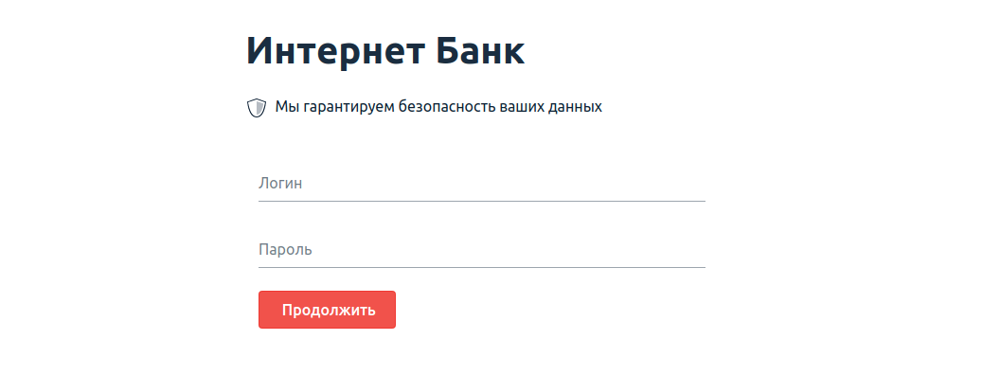
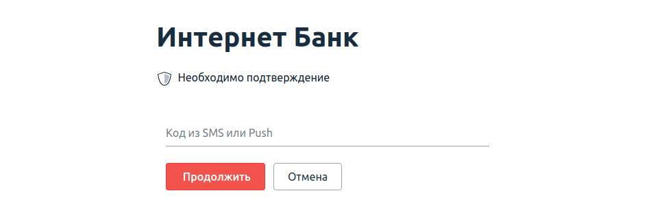

# Домашнее задание к занятию «1.3 SQL и транзакции»

В качестве результата пришлите ответы на вопросы в личном кабинете студента на сайте [netology.ru](https://netology.ru).

## Общая легенда

Разработчики подготовили прототип будущей системы интернет-банка.

Для запуска необходимо скачать файлы из каталога `assets`:
* [`docker-compose.yml`](./assets/docker-compose.yml)
* [`docker-entrypoint-initdb.d/init.sql`](./assets/docker-entrypoint-initdb.d/init.sql)

После скачивания структура на вашем диске должна выглядеть следующим образом:
* файл `docker-compose.yml`
* каталог `docker-entrypoint-initdb.d`
    * файл `init.sql`
    
Для запуска используйте команду: `docker-compose up`

Для остановки и удаления контейнеров: `docker-compose down`

## Задание Логин и пароль

### Порядок выполнения

Фронтенд сервиса работает на порту 8888:



Используя ваши знания об SQLi, попробуйте подобрать входные данные так, чтобы попасть на следующий экран (подтверждения кода) без знания пароля (при этом вы каким-то образом узнали, что в системе существует пользователь с логином `sasha`).

Примечание*: вы, конечно, можете подсмотреть хэш пароля в БД, но пароль-то ещё придётся подобрать.

<details>
<summary>Подсказка</summary>

Контейнер PostgreSQL настроен таким образом, что логирует все SQL-запросы, присылаемые сервером. Воспользуйтесь этим.
</details>

### Результаты

В качестве результата пришлите входные данные, которые позволяют пройти на следующий экран без знания пароля пользователя.

## Код подтверждения*

**Важно**: это необязательное задание. Его (не)выполнение не влияет на получение зачёта по ДЗ.

### Легенда

Если вы добрались до экрана ввода кода подтверждения, то увидите следующую картину:



### `UNION`

В SQL существуют специальная конструкция `UNION`, которая позволяет объединить данные нескольких запросов.

Пример:
```sql
SELECT login, password FROM users
UNION
SELECT number, status FROM cards
```

Сложит в результаты запроса данные из двух таблиц в виде:
| login | password |
| --- | ----------- |
| sasha | ... |
| masha | ... |
| 5559 0000 0000 0001 | ... |
| 5559 0000 0000 0002 | ... |

Вроде как пример бессмысленный, но позволяет "добавить" к данным, легитимно выбираемым приложением, произвольные по нашему усмотрению (если мы можем дописать часть с `UNION`).

Здесь стоит отметить, несколько ключевых моментов:
1. Количество полей и их типы должны совпадать в обоих `SELECT`'ах (для преобразования типов существуют специальные выражения или функции, например [для PostgreSQL](https://postgrespro.ru/docs/postgresql/13/typeconv))
1. Если первый `SELECT` ничего не вернёт (например потому, что в нём будет условие `WHERE`, которому не соответствует ни одна строка), то останутся только строки, полученные из второго `SELECT`'а.

Кроме того, здесь нужно указать и на то, что `SELECT` не обязательно должен выбирать данные из таблицы, например запрос вида `SELECT 'vasya', 'active'` вполне легитимный (он возвращает строку, в которой всего два столбца со значениями `vasya` и `active` соответственно).

### Порядок выполнения

1\. Проследите, какие данные отправляет браузер при вводе кода:


Поскольку мы ещё не проходили инструменты, позволяющие "модифицировать" отправляемые браузером запросы, то мы поступим более простым образом: кликните правой кнопкой мыши на запросе и выберите `Copy as cURL`:


2\. Можете попробовать теперь отредактировать запрос так, чтобы подставить свои данные в запрос (если не получилось - см.подсказку)

<details>
<summary>Подсказка</summary>

Отредактируйте в любом текстовом редакторе полученную строку до вида:

```text
curl 'http://localhost:9999/api/auth/verification' \
  -H 'Content-Type: application/json' \
  --data-raw $'{"login":"login","code":"8888"}'
```

Обратите внимание: если вы в `login` собираетесь подставлять `'` (одинарные кавычки), то их нужно экранировать через `\`, т.е. должно быть: `login \' your hack`.

</details>

3\. Отправьте подготовленный запрос через cURL так, чтобы получить в ответ токен доступа

**Важно**: после лекции по аутентификации вы сможете подставить данный токен доступа в браузер, чтобы напрямую работать из браузера (а после лекций OWASP - токен выдаст вам сам сервер).

### Результаты

В качестве результата пришлите cURL-запрос, который позволяет получить токен доступа без знания кода верификации.

## P.S.

P.S. конечно же, в данной ДЗ вы потренировались в использовании самых простых техник SQLi. Более продвинутые будут рассмотрены в темах OWASP.
