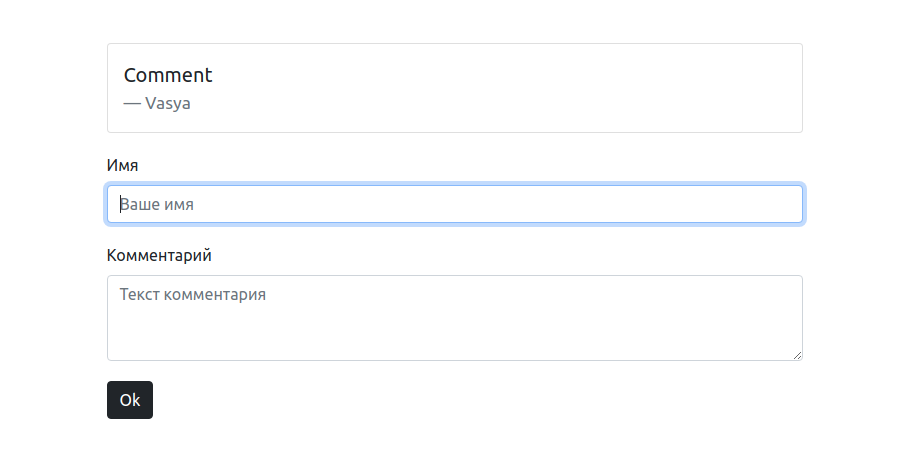
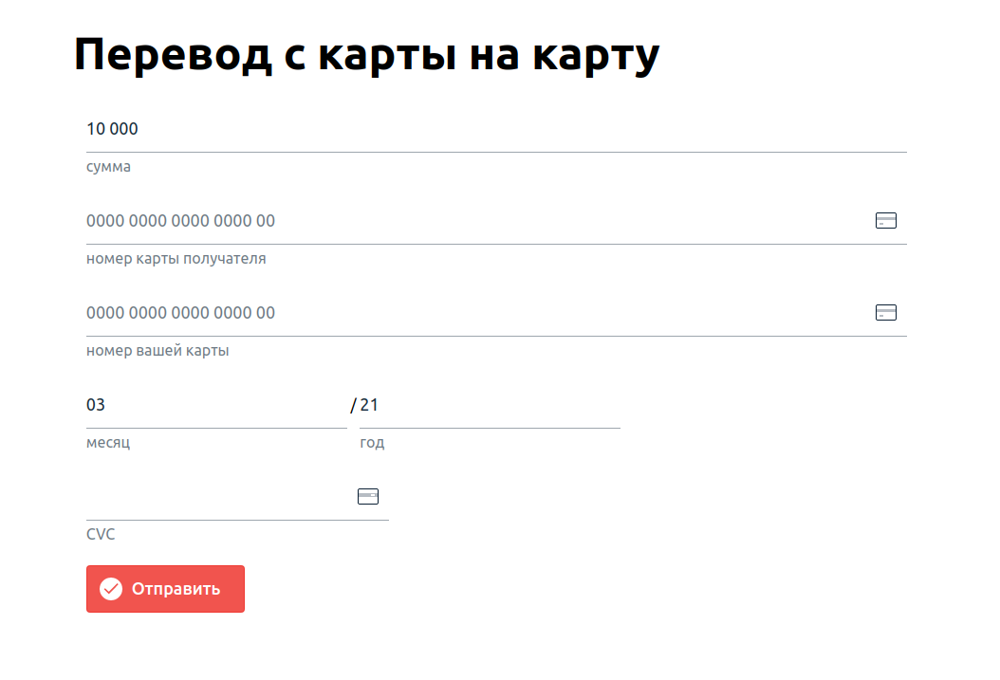

# Домашнее задание к занятию «1.4. JavaScript»

В качестве результата пришлите ответы на вопросы в личном кабинете студента на сайте [netology.ru](https://netology.ru).

## Задание «Комментарии»

### Описание

Вам дали прототип системы комментариев для социальной сети.

### Этапы выполнения 

Для запуска используйте `docker-compose.yml`:

```yaml
version: '3.7'
services:
  comments:
    image: ghcr.io/netology-code/ibweb-js-comments
    ports:
      - 9001:9001
```

Для запуска используйте команду `docker-compose up`.

Для остановки и удаления контейнеров используйте `docker-compose down`.

Фронтенд сервиса работает на порту 9001:



1. Откройте целевой сервис в двух экземплярах браузера — обычном и приватном — или в разных браузерах.
2. Отправьте ваш вредоносный ввод с помощью форм ввода так, чтобы он содержал код `alert('pwned')`, либо его вариации в первом экземпляре браузера.
3. Обновите страницу во втором экземпляре браузера: если код выполнится при загрузке или после выполнения целевых действий пользователя, например, клике (`onclick`), наведении указателя мыши (`onhover`) или других событиях ([см. полный список](https://developer.mozilla.org/en-US/docs/Web/Events)), то вы добились своего.

Примечание*. Часто будет достаточно `onclick`.

Используя ваши знания, попробуйте подобрать данные для формы таким образом, чтобы исполнился целевой код (`alert('pwned')`).

### Результаты выполнения задания

В качестве результата пришлите используемые вами для ввода данные.

## Задание «Трекер»* 

**Важно**: это необязательное задание. Его выполнение не влияет на получение зачёта по домашнему заданию.

### Описание

Один из банков установил на свою страницу переводов с карты на карты сторонний трекер активности. Такое часто бывает, можете посмотреть, какие сторонние скрипты подключаются на странице [Сбер Банка](https://securepayments.sberbank.ru/payment/merchants/p2p_transfer/index.html), [Альфа-Банка](https://www.alfaportal.ru/card2card/ptpl/alfaportal/initial.html) и других банков).

**Q**. Что делает трекер?

**A**. Он замеряет время, прошедшее с момента загрузки страницы до отправки пользователем перевода, и отправляет эту статистику на сторонний сервис.

Но спустя какое-то время начались жалобы со стороны клиентов банка об операциях, которые они не совершали, либо о попытках подобных операций.

Внутреннее расследование установило, что всех клиентов объединяет одно: они воспользовались этой страницей переводов после установки трекера.

**Ваша задача** — проанализировать данные, которые отправляет трекер, и попробовать определить, действительно ли он как-то причастен к этому происшествию.


### Этапы выполнения

Для запуска воспользуйтесь `docker-compose.yml`:

```yaml
version: '3.7'
services:
  comments:
    image: ghcr.io/netology-code/ibweb-js-tracker
    ports:
      - 9002:9002
```

Для запуска используйте команду `docker-compose up`.

Для остановки и удаления контейнеров используйте `docker-compose down`.

Фронтенд сервиса работает на порту 9002:



Тестовые карты для перевода взяты из [документации Сбер Банка](https://securepayments.sberbank.ru/wiki/doku.php/test_cards)):
* VISA 
    * Номер карты: 4111 1111 1111 1111 
    * Дата истечения срока действия: 2024/12
    * Проверочный код на обратной стороне (CVC/CVV): 123
* MasterCard
  * Номер карты: 5555 5555 5555 5599
  * Дата истечения срока действия: 2024/12
  * Проверочный код на обратной стороне (CVC/CVV): 123
* МИР
  * Номер карты: 2200 0000 0000 0053
  * Дата истечения срока действия: 2024/12
  * Проверочный код на обратной стороне (CVC/CVV): 123
  
Сам код трекера находится в файле `http://localhost:9002/tracker.min.js`. Код обфусцирован, т. е. обработан специальным образом для затруднения изучения логики работы.

**Важно**. Мы допускаем, что:
1. Логика срабатывания может быть хитрой: например, срабатывать не каждый раз, а раз в какой-то период, или накапливать данные и т. д.
2. Подозрения могут быть не обоснованными.

### Упрощения

Для упрощения:
- в сервисе не реализована вся цепочка осуществления платежа с подтверждением платежа по SMS;
- трекер отсылает запросы на тот же хост, с которого загружено целевое приложение, в реальной жизни хост будет другой.

### Результаты выполнения задания

В качестве результата пришлите ваше заключение о том, может ли быть трекер причастен к происшествию с клиентами. И если да, то каким образом. Нужно обоснование на основе полученных из анализа работы трекера данных. Из вывода будет следовать, что он передаёт что-то кроме заявленного времени работы.
