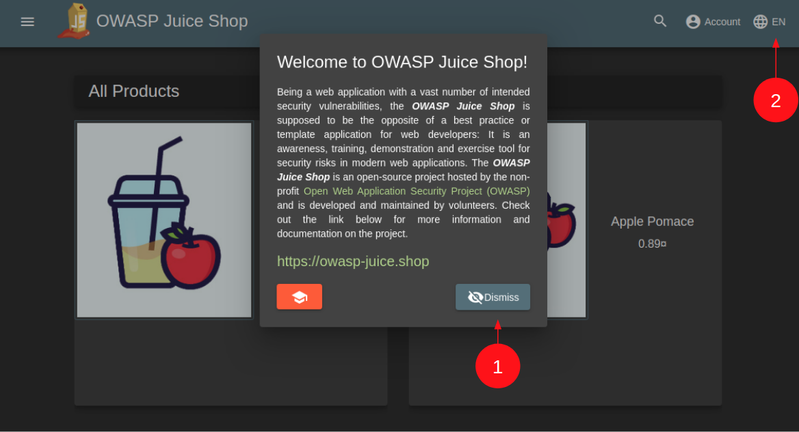
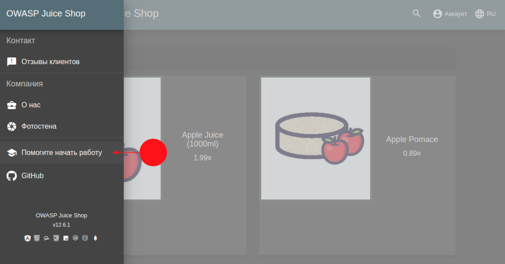
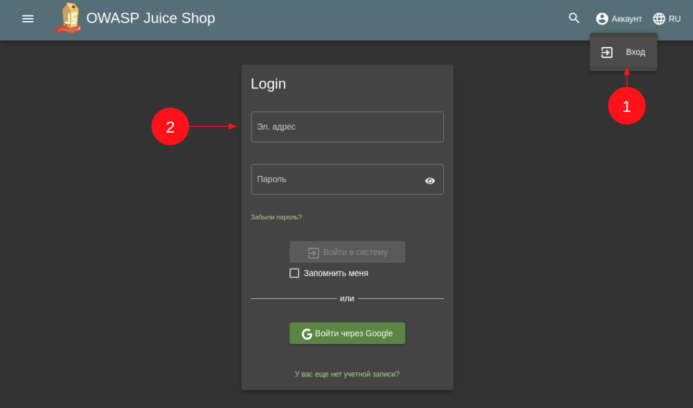

# Домашнее задание к занятию «2.1. OWASP»

Пришлите ответы на вопросы в личном кабинете студента на сайте [netology.ru](https://netology.ru).

## Общая вводная

Вы рассмотрите проект [OWASP Juice Shop](https://owasp.org/www-project-juice-shop/), входящий в [Vulnerable Web Application Directory](https://owasp.org/www-project-vulnerable-web-applications-directory/).

Для запуска ипользуйте `docker-compose.yml`:

```yaml
version: '3.7'
services:
  shop:
    image: bkimminich/juice-shop
    ports:
      - 3000:3000
```

Приложение запустится на 3000 порту. Вам нужно открыть `localhost:3000` в браузере и выбрать русский язык.



Далее в боковой панели выберете «Помогите начать работу».



## Задание SQLi

### Этапы выполнения

1. Перейдите на страницу логина.



2. Используя ваши знания об SQLi, попробуйте залогиниться в систему.

Часто при работе с СУБД возникают ошибки из-за некорректно составленных SQL-запросов, превышением лимита подключений, проблем с фиксацией транзакций и т. д. Эти ошибки пробрасываются из СУБД в само приложение, которое логгирует их, то есть записывает в лог-файл. Это позволяет программистам проводить анализ случившегося и быстрее исправлять ошибки. Часто для удобства на этапе разработки эти сообщения выводятся не только в лог-файл, но и дублируются в ответе, возвращаемом сервером по HTTP. Так они могут просачиваться в Production, если кто-то забыл отключить эту функцию.

То же самое будет происходить при подборе данных для SQLi — возникнет ошибка, которая может просочиться к вам в виде HTTP-ответа. Тогда вы не вслепую будете подбирать данные. Откройте инструменты разработчика браузера (`F12`) и внимательно посмотрите на то, какие ответы на ваш запрос вам возвращает сервер при нажатии на кнопку «Войти в систему».

Проанализируйте, под каким пользователем вам удалось войти, и ваши предположения о том, почему удалось войти именно под этим пользователем.

<details>
<summary>Подсказка</summary>

Для этого нужно:
1. проверить хранилища — Cookie, LocalStorage, SessionStorage — на предмет хранения аутентификационной информации;
2. посмотреть на данные, передаваемые в запросах — Headers;
3. посмотреть на данные, возвращаемые в ответах после аутентификации.
</details>

### Решение задания

В качестве решения пришлите:
1. использованные для ввода данные;
2. под каким пользователем вам удалось войти;
3. ваши предположения, почему удалось войти именно под этим пользователем;
4. где хранится аутентификационная информация, что она из себя представляет и как передаётся в каждом запросе.

## Задание robots.txt

Прочитайте информацию о файле [`robots.txt`](https://developers.google.com/search/docs/advanced/robots/intro?hl=ru) и [его детальное описание](https://developers.google.com/search/docs/advanced/robots/robots_txt?hl=ru).

Почитайте статьи на сайтах компаний, занимающихся информационной безопасностью:
* [Tenable](https://www.tenable.com/plugins/nessus/10302);
* [Synopsis](https://www.synopsys.com/blogs/software-security/robots-txt/).

### Этапы выполнения

На основании полученной информации проанализируйте целевой сервис на предмет корректности использования `robots.txt`.

### Решение задания

Пришлите ваш вывод, корректно ли используется `robots.txt`. Если нет, то почему и к каким последствиям это ведёт последствиям.

## Задание «Взлом администратора»

После успешной эксплуатации SQL-инъекции вы войдёте от имени администратора магазина. Чтобы узнать почту пользователя, можно обратить внимание на запрос 'http://localhost:3000/rest/user/whoami'. В ответе получите почтовый ящик администратора. Попробуйте проверить на прочность систему — подобрать пароль администратора.

### Этапы выполнения

Чтобы подобрать пароль, нужен инструмент для выполнения большого количества запросов. Конечно, можно написать скрипт, но рекомендуется использовать прокси Zed Attack Proxy или Burp Suite. 

Перейдите на страницу логина.


Введите почту администратора и случайный пароль. Получите запрос для аутентификации.

Отправьте запрос в Intruder ([Burp](https://portswigger.net/burp/documentation/desktop/tools/intruder)) или «Запуск Фаззинга»(ZAP). Выберите в качестве перебираемого параметра пароль. В качестве списка рекомендуется использовать [списки с самыми популярными паролями](https://github.com/danielmiessler/SecLists/blob/master/Passwords/Common-Credentials/100k-most-used-passwords-NCSC.txt).
Запустите перебор, найдите искомый пароль.

### Решение задания

Пришлите пароль, который стоял у администратора. Поясните, какие меры позволили бы защититься от атаки.
