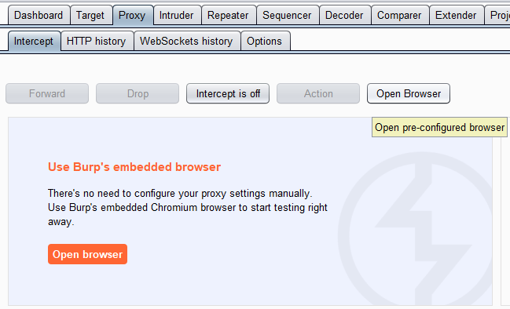
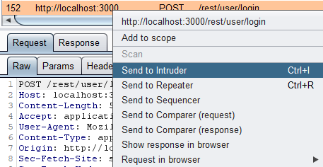
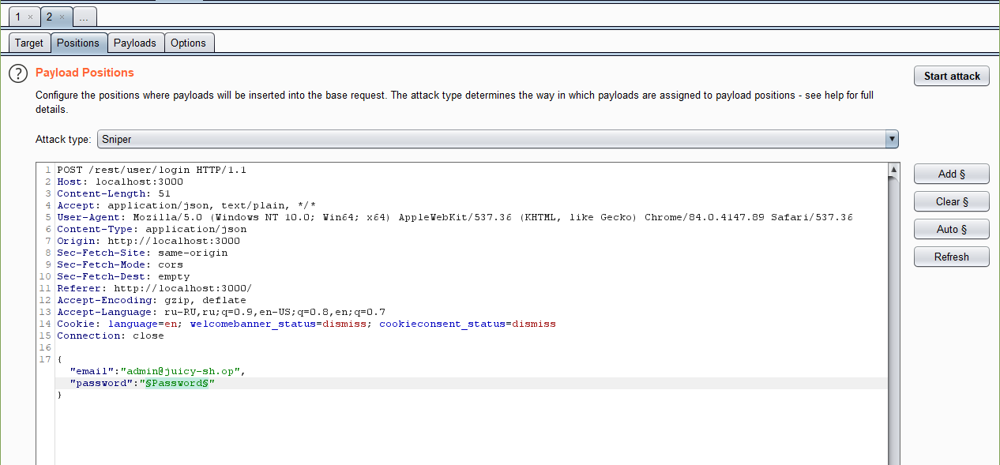
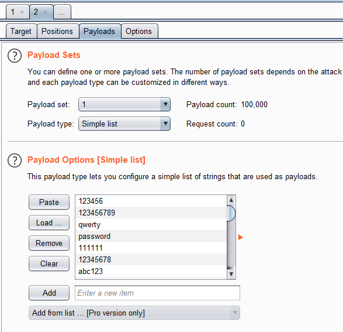
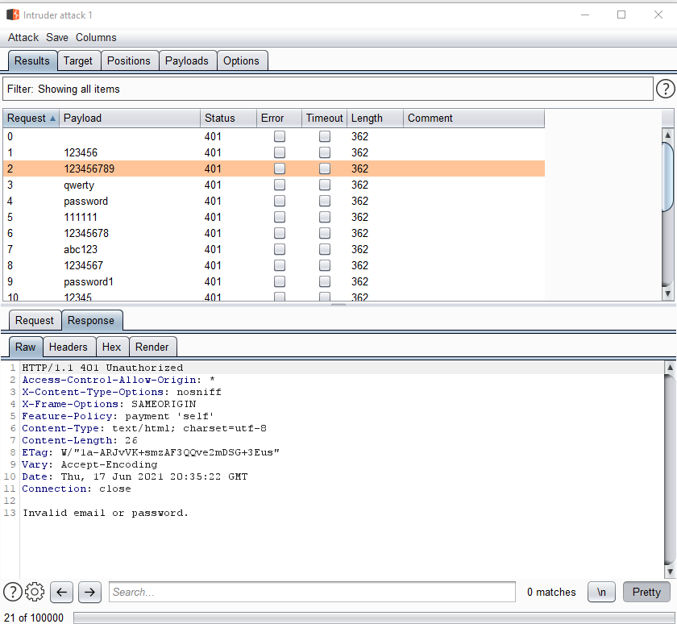

# Небольшая инструкция по использованию Burp Intruder 

## Зачем нужен Burp Intruder?

Burp Intruder - одна из функциональностей Burp Suite позволяющая перебирать различные параметры запроса. В основном используется для проверки наличия инъекций, XSS или для перебора логинов и паролей.

### Порядок выполнения

Основным функционалом Burp Suite является проксирование, все запросы проходящие через него попадают во вкладку `Proxy -> History`. В таблице видны все запросы, каждый из которых можно отправить в Intruder (для атак перебором) или Repeater (для точечной модификации и отправки запроса).

Для выполнения задания, нужно найти запрос содержащий в себе логин и пароль. Откройте Juicy Shop в браузере, который проксируется через Burp Suite. Можно настроить самостоятельно браузер для использования прокси `127.0.0.1:8080`. Или, воспользоваться встроенным браузером - `Proxy -> Intercept -> Open Browser`. Не забудьте выключить остановку запросов `Intercept is off`. 

Совершите запрос для входа в Juicy Shop. Найдите запрос в Burp Proxy. С помощью контекстного меню (правым кликом) отправьте запрос в Intuder.

Во вкладке Intuder необходимо выбрать параметры для перебора. Параметр для перебора выбирается с помощью знаков `§`. Параметров может быть несколько, могут быть применены различные виды атак:

* `Sniper` - все параметры имеют одно и то же значение
* `Pitchfork` - параметры соотносятся один к одному. То есть, количество запросов равно минимальному количеству пейлодов для параметра.
* `Cluster bomb` - параметры отправляются по принципу "каждый с каждым". Количество запросов равно произведению количества пейлодов для каждого параметра.

В нашем случае, нужно подобрать пароль,поэтоу подойдет режим `Sniper`. Во вкладке `Payloads` нужно выбрать тип параметров и загрузить сами пейлоды для тестирования. Рекомендуется использвоать [список самых часто используемых паролей](https://github.com/danielmiessler/SecLists/blob/master/Passwords/Common-Credentials/100k-most-used-passwords-NCSC.txt)

После настройки, нужно запустить атаку кнопкой Start Attack. Запустив, вы увидете окно в котором будут отображаться отправленные запросы. Успешность запроса можно определить по самому ответу, по коду ответа или по длине ответа.

