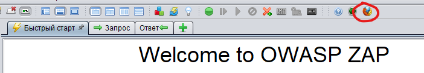
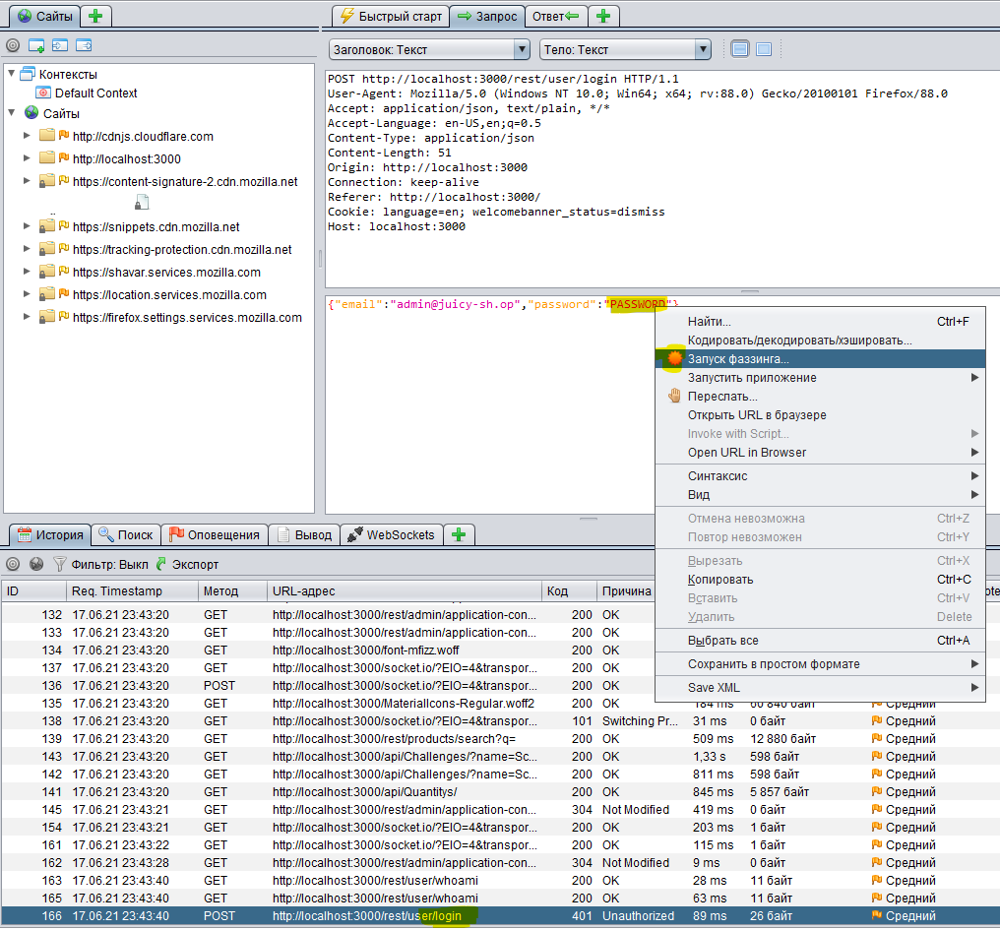
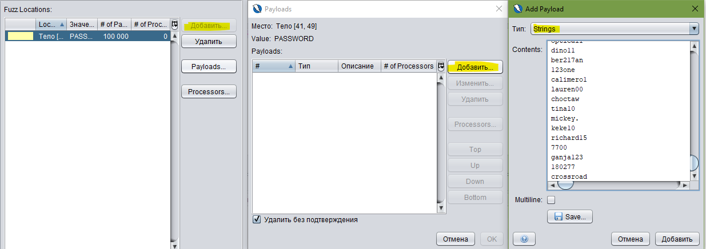

# Небольшая инструкция по использованию Zap Fuzzing

## Зачем нужен Zed Attack Proxy?

Zed Attack Proxy - оперсорсный прокси-сканер от OWASP предназначенный для анализа защищенности веб-приложений. Кроме пассивного анадлиза запросов, имеется возможность модифицировать запросы, перебирать запросы, строить карту сайта в автоматическом режиме. Нас интересует возможность перебора параметров, а именно - пароля пользователя.

### Порядок выполнения

Для отлова запросов и их последующего анализа и атаки, ZAP используется как прокси для браузера. Есть возможность запустить уже настроенный браузер Firefox (пиктограмма с изображением Firefox).

Отправив запрос на аутентификацию, необходимо найти запрос во вкладке "История". Запрос и полученный ответ отображаются в соответствующих вкладках в центре окна программы. Нужно открыть запрос, выделить параметр (в нашем случае пароль пользователя), и правой кнопкой мыши открыв контекстное меню, вызвать функцию `Запустить фаззинг`.

Во вкладке `Payloads` нужно выбрать тип параметров и загрузить сами пейлоды для тестирования. Рекомендуется использвоать [список самых часто используемых паролей](https://github.com/danielmiessler/SecLists/blob/master/Passwords/Common-Credentials/100k-most-used-passwords-NCSC.txt)

После выбора пейлодов, запустите фаззинг и смотрите за результатами перебора параметра. Успешность запроса можно определить по самому ответу, по коду ответа или по длине ответа.