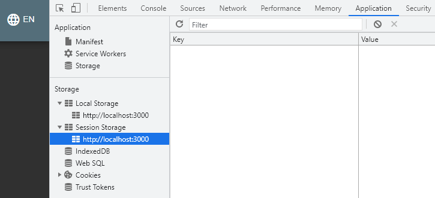

# Домашнее задание к занятию «2.2. OWASP»

Пришлите ответы на вопросы в личном кабинете студента на сайте [netology.ru](https://netology.ru).

## Описание

Вы рассмотрите проект [OWASP Juice Shop](https://owasp.org/www-project-juice-shop/), входящих в [Vulnerable Web Applications Directory](https://owasp.org/www-project-vulnerable-web-applications-directory/).

Для запуска используйте `docker-compose.yml`:

```yaml
version: '3.7'
services:
  shop:
    image: bkimminich/juice-shop
    ports:
      - 3000:3000
```

Приложение запустится на порту 3000, вам нужно открыть `localhost:3000`.

## Задание «Поиск»

В качестве Cheat Sheet, содержащего примеры возможного вода для проверки подверженности XSS, используйте [XSS Cheat Sheet](https://owasp.org/www-community/xss-filter-evasion-cheatsheet) от OWASP.

### Этапы выполнения

1. Проверьте поле поиска на сайте на подверженность XSS.

2. Проанализируйте, возможно ли ссылку, полученную в результате ввода в строку поиска, передать другому человеку, чтобы получить Reflected XSS. 

### Решение задания

В качестве решения пришлите:
1. использованныеданные для ввода;
2. пункт из XSS Cheat Sheet, в котором содержится пример, использованный для проверки подверженности поля поиска XSS.

Вы, конечно, можете загуглить готовое решение, но это будет не очень интересно и продуктивно.

## Задание «Чужая корзина»

Найдите IDOR в корзине. Посмотрите, что лежит в чужих корзинах. 

### Этапы выполнения

1. Положите что-то в свою корзину. 
2. Откройте саму корзину и инструменты разработчика. 
3. Проанализируйте, что лежит в куках и локальном хранилище. Попробуйте изменить данные, обновите страницу. 



### Решение задания

В качестве решения пришлите:
1. наименование параметра, который отвечает за открываемую корзину;
2. ваши рекомендации по исправлению этой незначительной уязвимости.
